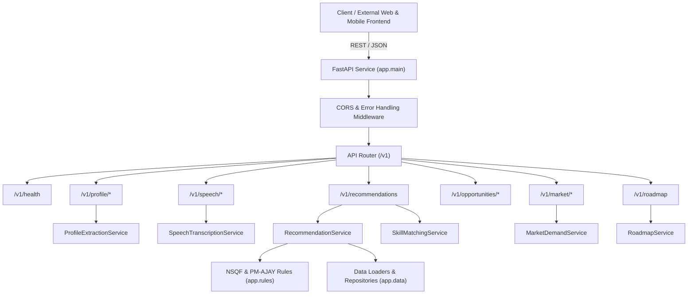

# Architecture Overview

## Project Summary
**Livelihood-Assistant** is an AI-driven, standalone voice and livelihood mapping assistant designed for Scheduled Caste (SC) communities under the **Pradhan Mantri Anusuchit Jaati Abhyuday Yojana (PM-AJAY)**. The service aligns beneficiary aspirations and existing skills with **NSQF (National Skills Qualifications Framework)** levels and local labor market demands.

## High-Level System Architecture

## Layered Design Principles
1. **Standalone & Decoupled**:
   - Zero hardcoded dependency on other repositories or external MongoDB instances.
   - Any client frontend or administrative backend can consume standard REST APIs.
2. **Contract-First & Type-Safe**:
   - Every endpoint relies on Pydantic schemas for request validation and response contracts.
3. **Clean Separation of Concerns**:
   - `routes/`: Handles HTTP parameters, status codes, and delegates logic to services.
   - `schemas/`: Defines domain payloads, validation rules, and output formats.
   - `services/`: Encapsulates business logic, AI pipelines, and third-party integrations (e.g., Gemini, Bhashini).
   - `rules/`: Static standards and policy criteria (NSQF levels, PM-AJAY eligibility).
   - `data/`: Ingestion loaders and repositories without direct DB coupling.
   - `core/`: Environment settings, custom exceptions, and logging configuration.
